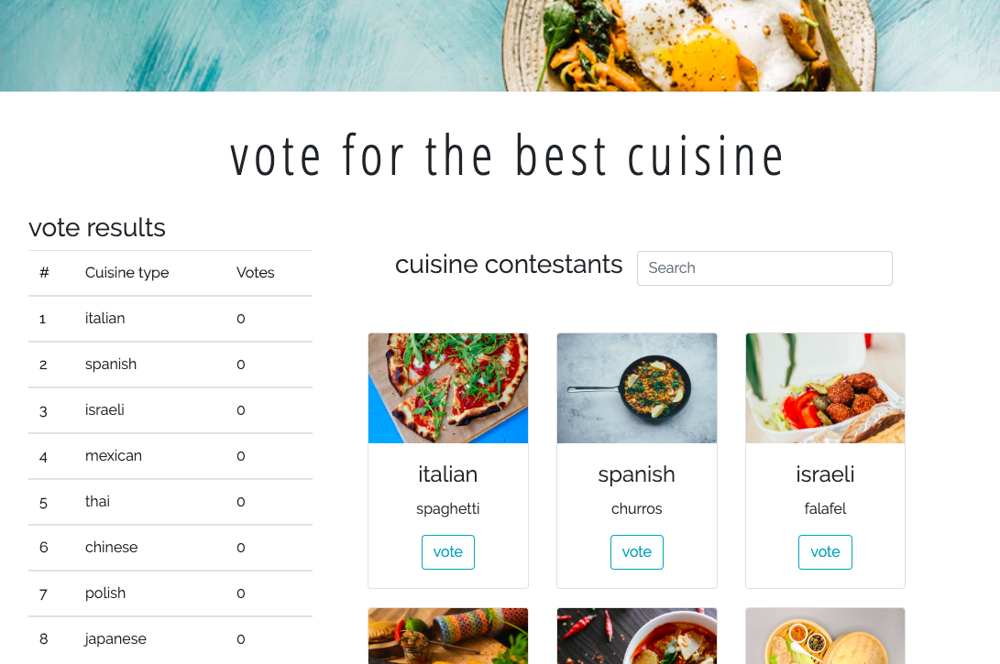

# cuisine vote 🍜
An app in which you vote for the best cuisine.

[Website demo](https://agatapst.github.io/cuisine_vote/)

## Table of Contents
- General info
- Technologies
- Status
- Additional info

### General info
Project is a simple vote app. Clicking the button, user can vote for the best cuisine listed on the website. After voting, it is possible to see the results in the table. Additional features are adding new cuisine to the list as well as searching for the cuisine (filtering the list).

### Technologies
- CSS3
- HTML5
- Bootstrap 4
- Vue.js

### Status
The basic version of the project is done. In the future, Firebase will be used to store data.

### Additional info
The whole concept and project layout were designed by me.

Photos were downloaded from [Unsplash](https://unsplash.com).